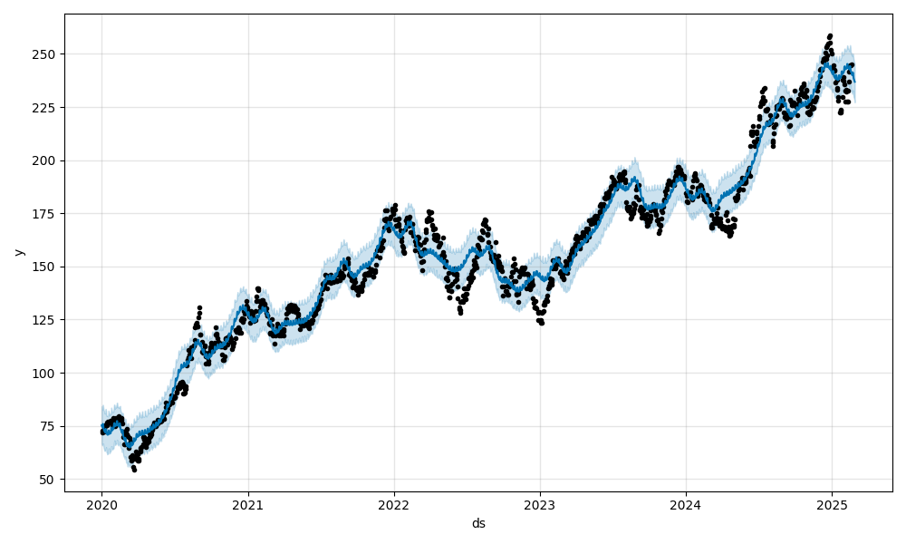
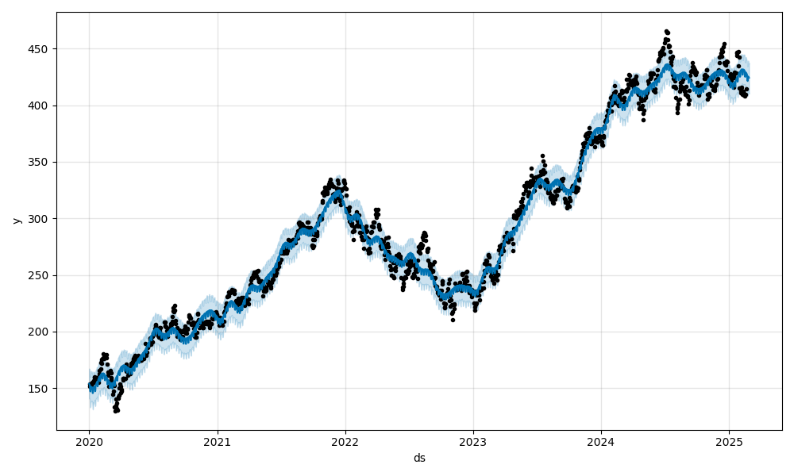
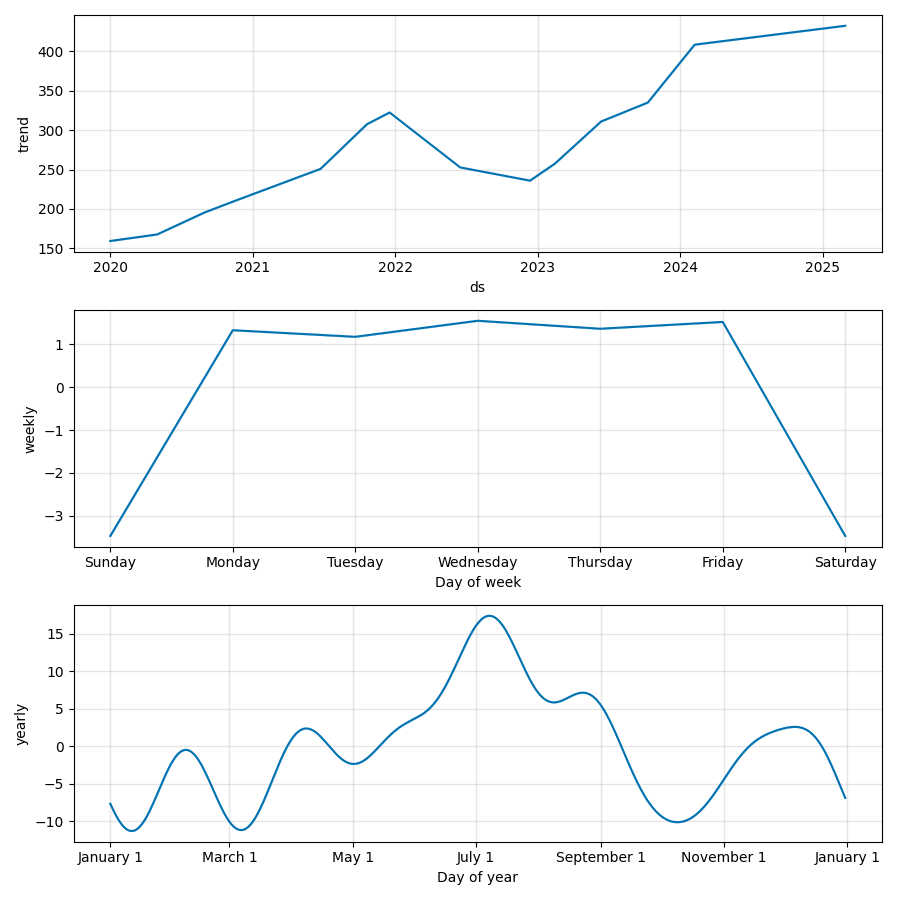

# 🤖MLServe - FastAPI ML Model Deployment
🚧 UNDER ACTIVE DEVELOPMENT 🚧

## 🚀 Overview

This project demonstrates how to **serve a machine learning model** using **FastAPI** and **Docker** into production as a RESTful API using FastAPI. The API allows users to send data and receive stock price predictions using [Prophet](https://facebook.github.io/prophet/) ML model.

## 📌 Features

*   **FastAPI-based REST API** for serving ML predictions.
*   **Dockerized deployment** for easy scalability.
*   **Asynchronous request handling** for efficient inference.
*   **Model versioning and logging** to track performance.
*   **CI/CD integration** (future enhancement) for automated deployments.

## 🏗️ Architecture

1.  **Pretrained ML Model** – A trained model is saved and loaded for inference.
2.  **FastAPI Backend** – Exposes RESTful endpoints for making predictions.
3.  **Docker Containerization** – The application runs inside a container for portability.
4.  **(Optional) Cloud Deployment** – Can be deployed on AWS/GCP/Azure using Kubernetes or serverless functions.

## 🛠️ Installation

### 1️⃣ Clone the repository

    git clone https://github.com/yourusername/fastapi-ml-deploy.git
    cd fastapi-ml-deploy
    

### 2️⃣ Install dependencies

    pip install -r requirements.txt
    

### 3️⃣ Run FastAPI server

    uvicorn app.main:app --host 0.0.0.0 --port 8000 --reload
    

### 4️⃣ Test API

Open your browser and visit:

    http://127.0.0.1:8000/docs
    

## 🐳 Docker Setup

### 1️⃣ Build the Docker image

    docker build -t fastapi-ml-app .
    

### 2️⃣ Run the container

    docker run -p 8000:8000 fastapi-ml-app
    

## 📡 API Endpoints

### 🔹 Root Endpoint

    GET /
    

_Response:_ "Welcome to FastAPI ML Deployment"

### 🔹 Predict

    POST /predict/
    

**Request Body:**

    {
        "feature1": 1.23,
        "feature2": 4.56,
        "feature3": 7.89
    }
    

**Response:**

    {
        "prediction": 0.92
    }

## 📊 Prediction Charts

Here are sample stock price predictions generated using the **Prophet** model:

### Apple (AAPL)

### Microsoft (MSFT)

### Google (GOOG)

### 📊 Interpreting the Prediction Charts

When generating stock price forecasts using Prophet, the visualization includes:

- **⚫ Black Dots (y)** → Actual historical stock prices used for training.
- **🔵 Blue Line (ŷ or yhat)** → The model’s predicted stock price (**yhat**).
- **🔹 Shaded Light Blue Area** → The confidence interval, representing the expected range of price fluctuations:
  - **Upper Bound (yhat_upper)** → Maximum expected price.
  - **Lower Bound (yhat_lower)** → Minimum expected price.

📌 **Trend and Seasonality Components**:
The model also breaks down the stock price into **trend** and **seasonality effects** which is covered in the next section.

## 🧠 Machine Learning Model Details

The model used in this project is **Facebook Prophet**, which forecasts stock prices based on historical market data. It generates time-series predictions, showing both **trends** and **seasonal effects**.

### 📊 Sample Forecast Visualization

Here’s an example of how the model predicts stock prices over time:

| Date        | Predicted Price ($) |
|------------|--------------------|
| 2025-02-20 | 190.12 |
| 2025-02-21 | 191.45 |
| 2025-02-22 | 192.78 |

---

### 📌 **Trend and Seasonality Components**
Prophet decomposes the time-series data into **three main components**:

1. **Trend** – The overall direction of the stock price over time.
2. **Seasonality** – Repeating patterns at daily, weekly, or yearly intervals.
3. **Holidays/Events** – External factors that impact stock prices.

Here’s an example of the **trend and seasonal effects** visualized for MSFT:

---

### 🔍 **Understanding the Forecast**
- The **blue line** represents the predicted stock price.
- **Seasonality plots** (daily, weekly, yearly) reveal recurring patterns.

These insights can help traders and analysts make **informed investment decisions**. 🚀

## 🚀 Future Enhancements

*   ✅ **Deploy on Kubernetes** using Minikube or cloud providers.
*   ✅ **Implement batch predictions** for processing large datasets.
*   ✅ **Add authentication & API rate limiting** for security.
*   ✅ **CI/CD pipeline** to automate testing & deployment.
